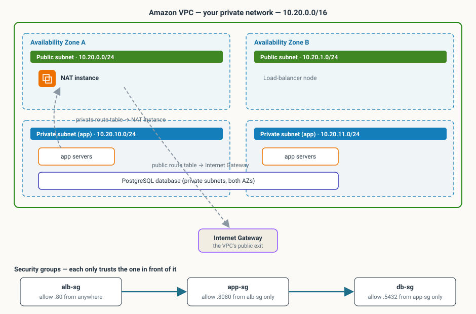
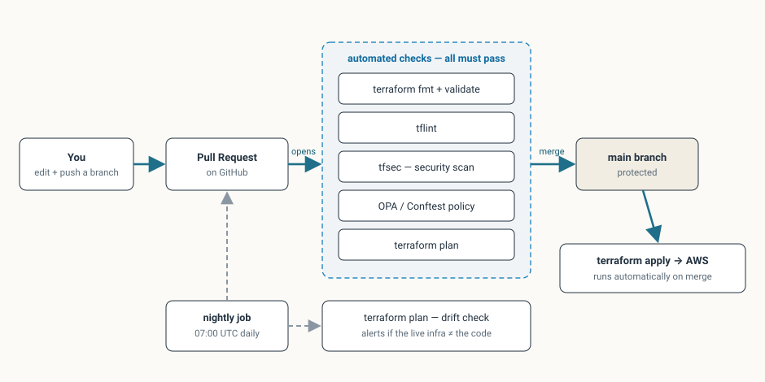
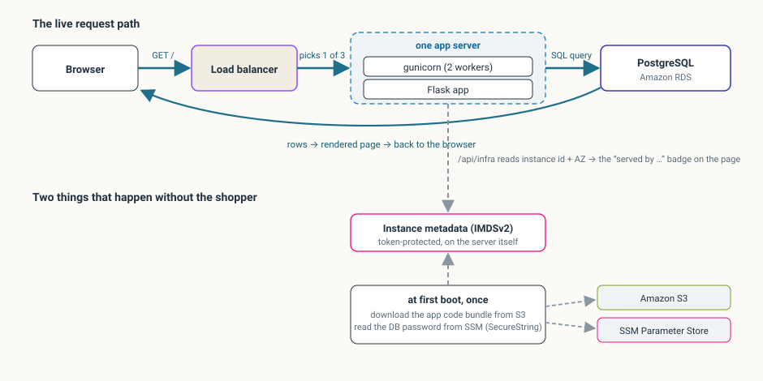

# Architecture

## Problem statement

A small online retailer needs a storefront that stays available when one
Availability Zone or one server fails, scales when traffic rises, is observable,
keeps its database off the public internet, and can be rebuilt from code. It
must run at near-zero cost on an AWS Free Tier account.

## High-level design


Three tiers, each isolated by subnet and security group:

| Tier | Where | What |
|---|---|---|
| **Edge** | Public subnets, 2 AZs | Application Load Balancer, NAT instance |
| **Application** | Private subnets, 2 AZs | Auto Scaling Group of EC2 instances running the Flask app under gunicorn |
| **Data** | Private subnets, 2 AZs (subnet group) | RDS PostgreSQL 16, single-AZ, not publicly accessible |

Traffic path: `Internet → ALB (:80) → target group (:8080) → gunicorn → psycopg2 → RDS (:5432)`.



## Components

### Networking (`modules/networking`)

- **VPC** `10.20.0.0/16`, DNS support and hostnames enabled.
- **Subnets** — 2 public (`10.20.0.0/24`, `10.20.1.0/24`) and 2 private
  (`10.20.10.0/24`, `10.20.11.0/24`), one pair per AZ (`eu-north-1a`,
  `eu-north-1b`). CIDRs are derived with `cidrsubnet()` so the module scales to
  more AZs by changing one variable.
- **Internet Gateway** — attached to the VPC; default route for the public
  route table.
- **NAT instance** — a single `t3.micro` running the community `fck-nat`
  AMI, in a public subnet, with `source_dest_check = false` and an Elastic IP.
  The private route table sends `0.0.0.0/0` to this instance's network
  interface. Chosen over a managed NAT Gateway to stay free (see *Trade-offs*).
- **Route tables** — public → IGW; private → NAT instance. One of each,
  associated with both subnets of that tier.
- **VPC Flow Logs** — all traffic, delivered to a CloudWatch log group
  (`/vpc/ce-capstone/flow-logs`, 3-day retention) via a dedicated IAM role.

### Security groups (`modules/security`)

Least-privilege, chained by reference rather than CIDR:

| Group | Ingress | Egress |
|---|---|---|
| `alb-sg` | TCP 80 from `0.0.0.0/0` (public web tier) | all |
| `app-sg` | TCP 8080 **from `alb-sg` only** | all |
| `db-sg` | TCP 5432 **from `app-sg` only** | all |

There is no SSH ingress anywhere. Instance access is through **AWS Systems
Manager Session Manager** (the instance role carries `AmazonSSMManagedInstanceCore`).

### Application platform (`modules/compute`)

- **Launch template** — latest Amazon Linux 2023 AMI (resolved from the public
  SSM parameter), `t3.micro`, 8 GB encrypted gp3 root volume, **IMDSv2
  required**, an IAM instance profile, and a user-data script.
- **User-data** — installs Python + the CloudWatch agent, downloads the
  application bundle from S3, creates a virtualenv, installs
  `requirements.txt`, reads DB credentials and the Flask secret from SSM
  Parameter Store, and starts gunicorn under systemd.
- **Application delivery** — `app/src/` is zipped by Terraform
  (`archive_file`), uploaded to a private S3 bucket with the content hash in
  the object key, and pulled by each instance at boot. Changing the app
  produces a new object key, which changes the launch template, which an
  instance refresh rolls out.
- **ALB** — internet-facing, in the public subnets, `drop_invalid_header_fields`
  on. HTTP:80 listener forwards to the target group.
- **Target group** — HTTP:8080, health check `GET /health` expecting `200`,
  15 s interval, 2 healthy / 3 unhealthy thresholds.
- **Auto Scaling Group** — `min 3 / desired 3 / max 4`, spread across both
  private subnets, `health_check_type = "ELB"`, rolling instance refresh
  (50 % min healthy).
- **Scaling** — a target-tracking policy holds average CPU at 50 %; two
  scheduled actions scale in to 1 instance at 22:00 UTC and back to 3 at
  06:00 UTC to save Free-Tier instance-hours overnight.

### Data (`modules/data`)

- **RDS PostgreSQL** `16.13`, `db.t3.micro`, 20 GB gp3, **storage encrypted**,
  single-AZ, `publicly_accessible = false`, in a DB subnet group across both
  private subnets, attached to `db-sg`, 1-day automated backup retention.
- **Credentials** — the master password and the Flask session secret are
  generated by Terraform (`random_password`) and stored as **SSM
  SecureString** parameters under `/ce-capstone/`. They are never written to
  an output or committed.
- **Schema** — the application creates its tables and seeds a demo catalogue
  on start (`CREATE TABLE IF NOT EXISTS` + `ON CONFLICT DO NOTHING`, so it is
  safe to run from every instance). A production system would use a one-shot
  migration job.

### Observability (`modules/monitoring`)

- **One CloudWatch dashboard** (`ce-capstone-overview`) — ALB requests & 5xx,
  target latency p50/p95/p99, healthy vs unhealthy hosts, EC2 CPU by ASG,
  memory & disk from the CloudWatch agent, and RDS CPU / connections / freeable
  memory.
- **Log aggregation** — gunicorn access + error logs go to
  `/ce-capstone/app` (3-day retention) via the CloudWatch agent. VPC flow logs
  go to their own group.
- **Alarms** (4):
  | Alarm | Condition |
  |---|---|
  | `alb-5xx-high` | target 5xx count > 5 per minute, 2 periods |
  | `unhealthy-hosts` | unhealthy host count > 0, 2 periods |
  | `latency-p95-high` | target response time p95 > 1.5 s, 3 periods |
  | `asg-cpu-high` | ASG average CPU > 75 %, 3 periods |
- **Alarm notification pipeline** — the default CloudWatch alarm email is a wall
  of JSON, so a small Lambda reformats it:

  ```
  alarm → SNS "ce-capstone-alerts" → Lambda (alarm_formatter.py)
        → SNS "ce-capstone-alerts-email" → email
  ```

  Two topics because SNS can't rewrite a message in place and a Lambda that
  published back to its trigger topic would loop. The Lambda (`python3.13`,
  stdlib + `boto3`, no deps) parses the alarm JSON and publishes a short body —
  alarm name, state, region, reason, time, and a next-step hint keyed off the
  metric namespace. Behind a `enable_alarm_formatter` toggle. `alerts-email` is
  encrypted with `alias/aws/sns`; `alerts` is not (see below).
- **SNS encryption** — `alerts` is left unencrypted because **CloudWatch Alarms
  cannot publish to a topic encrypted with the AWS-managed key `alias/aws/sns`**
  and a customer-managed KMS key is out of Free-Tier scope. The topic carries
  only alarm metadata. See [SECURITY.md](SECURITY.md) *Known risks*.

### Governance (`modules/governance`)

- **AWS Config** recorder scoped to seven resource types (EC2 instance / SG /
  VPC, S3 bucket, IAM role / policy, RDS instance) to keep cost minimal, with a
  dedicated delivery S3 bucket and bucket policy.
- **Five managed rules**: `restricted-ssh`, `s3-bucket-public-read-prohibited`,
  `encrypted-volumes`, `rds-storage-encrypted`, `vpc-flow-logs-enabled`.
- The recorder is behind a `recorder_enabled` toggle so it can be stopped once
  compliance evidence is captured.

### CI/CD (`.github/workflows`)



- **`terraform-plan.yml`** (on PR) — `fmt -check`, `init`, `validate`, `tfsec`
  (HIGH gate), the OPA policy, `terraform plan`.
- **`terraform-apply.yml`** (on push to `main`) — `terraform apply`.
- **`drift.yml`** (scheduled, daily) — `terraform plan -detailed-exitcode`;
  exit code 2 (drift) fails the job.
- **`terratest.yml`** (on demand / module PRs / nightly, **not** a required
  check) — two Go module-contract tests: a plan-only check of the networking
  module and a real apply/destroy check of the security-group chain.
- Branch protection on `main` requires the `plan` check and blocks direct
  pushes. Authentication uses a dedicated `ce-capstone-ci` IAM user
  (see [ADR 0001](docs/decisions/0001-ci-authentication.md)).

## High-availability strategy

- **Compute** — the ASG keeps 3 instances spread across 2 AZs; `health_check_type
  = "ELB"` means a target that fails `/health` is replaced automatically. Losing
  an AZ leaves at least one healthy instance serving.
- **Load balancer** — the ALB is a managed, multi-AZ service with nodes in both
  public subnets.
- **Data** — RDS is **single-AZ** (a deliberate Free-Tier trade-off). Automated
  daily backups provide point-in-time-ish recovery within a day. Production
  would enable Multi-AZ.
- **NAT** — the NAT instance is a **single point of failure**. If it dies,
  running instances keep serving traffic (inbound path is unaffected) but lose
  outbound internet until the instance is replaced. Production would use a NAT
  Gateway per AZ, which the module supports via `nat_mode = "gateway"`.

## Scalability considerations

- Horizontal scaling is automatic via the target-tracking policy; `max_size` is
  capped at 4 to stay within Free-Tier instance-hours, not because of a design
  limit — raising it is a one-line change.
- The database is the vertical bottleneck (`db.t3.micro`, 2 vCPU / 1 GB). Next
  steps would be a read replica for read-heavy catalogue traffic and a larger
  instance class.
- Static assets are served by Flask today; a production build would put them
  behind CloudFront / S3.

## Technology choices and rationale

| Choice | Why | Alternative considered |
|---|---|---|
| Terraform | Course standard; mature AWS provider; module reuse | CloudFormation, CDK |
| EC2 + ASG (not ECS/EKS) | Simplest path to the graded multi-tier + HA + LB requirements in one week | ECS Fargate — more moving parts (ECR, task defs) for no extra rubric credit |
| NAT **instance** | ~$0 on Free Tier vs ~$32/mo for a NAT Gateway | NAT Gateway — kept as `nat_mode = "gateway"` for production |
| Single-AZ RDS | Free-Tier eligible | Multi-AZ — doubles cost, out of scope |
| SSM Parameter Store (SecureString) | Free; native Terraform + EC2 support | Secrets Manager — $0.40/secret/month |
| App bundle via S3 | Multi-file app (templates/static) can't be embedded in user-data | ECR + Docker — more infrastructure for a systemd-based deploy |
| Drift detection as the primary check, plus 2 Terratest module tests | Drift needs no new tooling and catches out-of-band changes; the two module-contract tests are a small, cheap supplement | Full Terratest deploy suite — cost/tooling not worth it, see [ADR 0002](docs/decisions/0002-drift-detection-over-terratest.md) |
| Static access keys for CI | OIDC federation failed on this account | OIDC — see [ADR 0001](docs/decisions/0001-ci-authentication.md) |

## Trade-offs and known limitations

- **Single-AZ database** and **single NAT instance** — accepted for Free Tier;
  both have a documented production path.
- **HTTP only** — no ACM certificate / custom domain (would cost money for the
  domain). The ALB listener is HTTP:80.
- **CI runs as an access-key IAM user**, not OIDC — mitigated by scoping the
  user off `AdministratorAccess` (`docs/ci-policy.json`) and confining the keys
  to GitHub's encrypted secret store.
- **Schema seeding runs per instance** rather than once — idempotent, but a
  migration job is the production form.
- **`alerts` SNS topic is unencrypted** — CloudWatch Alarms cannot publish to a
  topic encrypted with the AWS-managed key `alias/aws/sns`, and a customer-managed
  KMS key is out of Free-Tier scope. The topic carries only alarm metadata; the
  downstream `alerts-email` topic is encrypted.

## Application



A Flask storefront (`app/src/app.py`) — deliberately minimal. Endpoints:

| Route | Purpose |
|---|---|
| `GET /` | the storefront page |
| `GET /health` | shallow check (always 200 while the process is up) — used by the ALB |
| `GET /api/health` | deep check including a database connection — used by dashboards / alarms |
| `GET /api/products`, `/api/categories`, `/api/products/<id>` | catalogue, backed by RDS with an in-memory fallback if the DB is unreachable |
| `POST /api/orders` | transactional order with `SELECT … FOR UPDATE` row locking and stock decrement |
| `GET /api/infra` | the serving instance's ID and AZ (via IMDSv2) — powers the "served by" badge in the UI |
