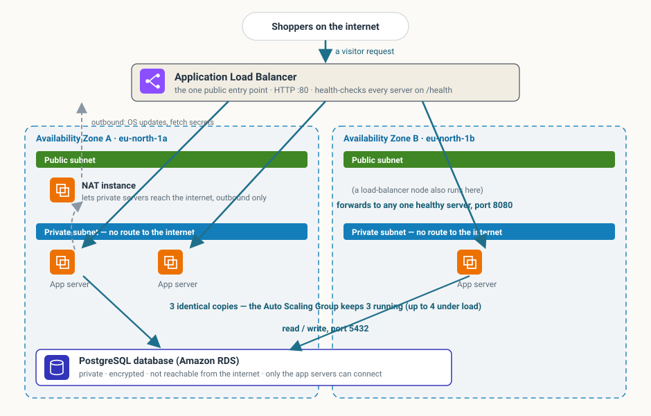

# CloudCart — Production-Ready Cloud Platform (Cloud Engineering Capstone)

CloudCart is a small e-commerce storefront running on AWS, deployed entirely
with Terraform and delivered through a GitOps CI/CD pipeline. The application is
deliberately simple — the focus of this project is the **infrastructure**:
multi-tier networking, high availability, observability, security controls, and
cost discipline, all built to run inside the AWS Free Tier.

| | |
|---|---|
| **Live URL** | `http://ce-capstone-alb-2112669035.eu-north-1.elb.amazonaws.com` |
| **Region** | `eu-north-1` (Stockholm) |
| **Account** | `128529977749` (personal, AWS Free Tier) |
| **IaC** | Terraform `>= 1.7`, AWS provider `~> 5.0` |
| **Repo** | `adnannooruddin21-hue/ce-capstone-ecommerce-platform` (public) |

## Architecture at a glance



```
Internet
  │
  ▼
Application Load Balancer          (public subnets, 2 AZs)
  │
  ▼
Auto Scaling Group — 3× EC2        (private subnets, 2 AZs, t3.micro)
  │            │
  │            └── NAT instance ──► Internet   (outbound only, for package + SSM/CloudWatch traffic)
  ▼
RDS PostgreSQL 16                  (private subnets, single-AZ, not publicly accessible)
```

Full detail in [ARCHITECTURE.md](ARCHITECTURE.md).

## Repository layout

```
.
├── README.md ARCHITECTURE.md SECURITY.md RUNBOOK.md COSTS.md RETROSPECTIVE.md WORKLOG.md
├── terraform/
│   ├── backend.tf providers.tf versions.tf variables.tf main.tf outputs.tf
│   ├── bootstrap/            one-time: S3 state bucket + DynamoDB lock table
│   └── modules/
│       ├── networking/       VPC, subnets, IGW, NAT instance, route tables, VPC flow logs
│       ├── security/         ALB / app / DB security groups
│       ├── compute/          launch template, ALB, target group, ASG, scaling policies, app S3 bundle
│       ├── data/             RDS PostgreSQL, DB subnet group, SSM SecureString parameters
│       ├── monitoring/       CloudWatch dashboard, 4 alarms, SNS topic, log group, agent config
│       └── governance/       AWS Config recorder + 5 managed rules + delivery bucket
├── app/
│   ├── src/                  Flask storefront (app.py, templates/, static/), requirements.txt
│   └── docker-compose.yml    local development (app + PostgreSQL)
├── .github/workflows/        terraform-plan.yml, terraform-apply.yml, drift.yml, terratest.yml
├── policy/                   Conftest / OPA policy enforced on every PR
├── monitoring/               dashboard + agent config + alert definitions + Logs Insights queries
└── docs/
    ├── architecture/         diagrams (generated by generate.py)
    ├── decisions/            Architecture Decision Records
    ├── incident-reports/     RCAs for issues hit during the build
    ├── ci-policy.json        least-privilege policy for the CI user
    └── prowler-ce-capstone.* compliance scan output
```

## Prerequisites

- AWS account (Free Tier) and the AWS CLI configured (`aws configure`)
- Terraform `>= 1.7`
- Docker Desktop (for local development only)
- `gh` (GitHub CLI) for the PR workflow

## Deploying from scratch

**1. Bootstrap the remote state backend** (run once, uses local state):

```bash
cd terraform/bootstrap
terraform init
terraform apply -var "github_repo=adnannooruddin21-hue/ce-capstone-ecommerce-platform"
cd ../..
```

This creates the S3 state bucket (`ce-capstone-tfstate-128529977749`), the
DynamoDB lock table (`ce-capstone-tflock`), and the GitHub OIDC deploy role.

**2. Deploy the platform:**

```bash
cd terraform
terraform init
export TF_VAR_alarm_email="you@example.com"     # for the SNS alarm subscription
terraform apply
```

RDS takes 8–12 minutes on first apply. After it completes, roll the fleet so
instances pick up the database credentials:

```bash
aws autoscaling start-instance-refresh --region eu-north-1 \
  --auto-scaling-group-name ce-capstone-asg --preferences '{"MinHealthyPercentage":50}'
```

**3. Get the URL:**

```bash
terraform output -raw alb_dns_name
```

Confirm the email SNS subscription (AWS sends a confirmation link) so alarms
can reach you.

### Ongoing changes

Never applied by hand after the first deploy. Open a pull request; the
`terraform-plan` workflow runs `fmt`, `validate`, `tflint`, `tfsec`, the OPA
policy, and `terraform plan`. On merge to `main`, `terraform-apply` deploys.
Branch protection blocks direct pushes to `main`.

## Local development

```bash
cd app
docker compose up --build
# http://localhost:5000   — runs the app against a local PostgreSQL container
```

## Testing

| Layer | How |
|---|---|
| Static | `terraform fmt -check`, `terraform validate`, `tflint`, `tfsec` (HIGH gate) — run on every PR |
| Policy | Conftest / OPA rules in `policy/` — run on every PR |
| Module | Terratest in `tests/` (`terratest.yml`, non-blocking) — plan-checks the networking module, apply/destroy-checks the security-group chain |
| Drift | Scheduled `terraform plan -detailed-exitcode` (`drift.yml`, daily 07:00 UTC) — fails if live infra ≠ code |
| Functional | `curl $ALB/api/health` → `{"status":"ok","database":"ok"}`; `curl $ALB/api/products` → 8 products; `POST /api/orders` → `201` |
| Resilience | terminate an instance → the ASG replaces it, traffic keeps flowing |

## Cost

Built and run inside the AWS Free Tier. Month-to-date spend: **≈ $0.00**. See
[COSTS.md](COSTS.md) for the per-service breakdown, the optimisation decisions,
and a production-scale projection.

## Teardown

```bash
cd terraform && terraform destroy
cd bootstrap && terraform destroy -var "github_repo=adnannooruddin21-hue/ce-capstone-ecommerce-platform"
```

Then check the console for orphans: Elastic IPs, EBS snapshots, CloudWatch log
groups, and the AWS Config recorder.

## Author

Adnan Nooruddin — Cloud Engineering bootcamp, Week 9 capstone.
